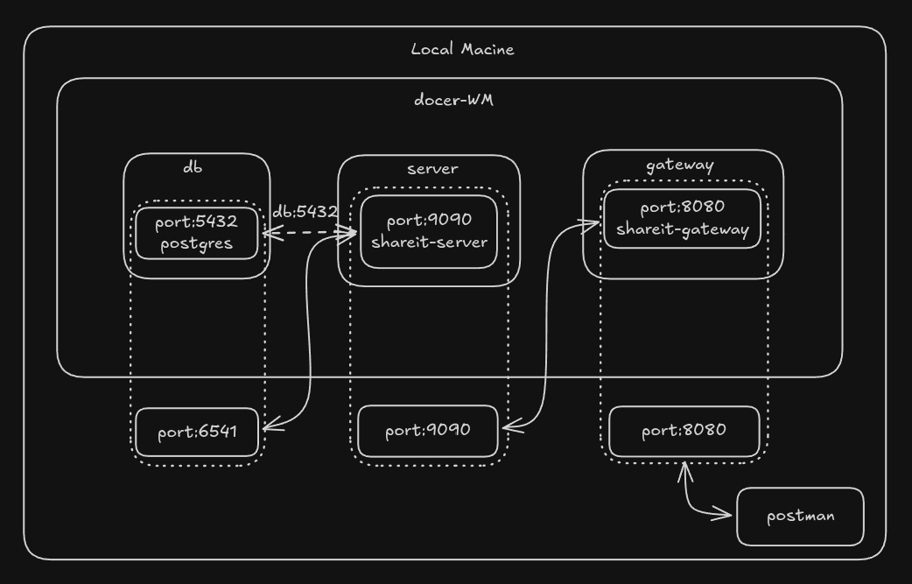
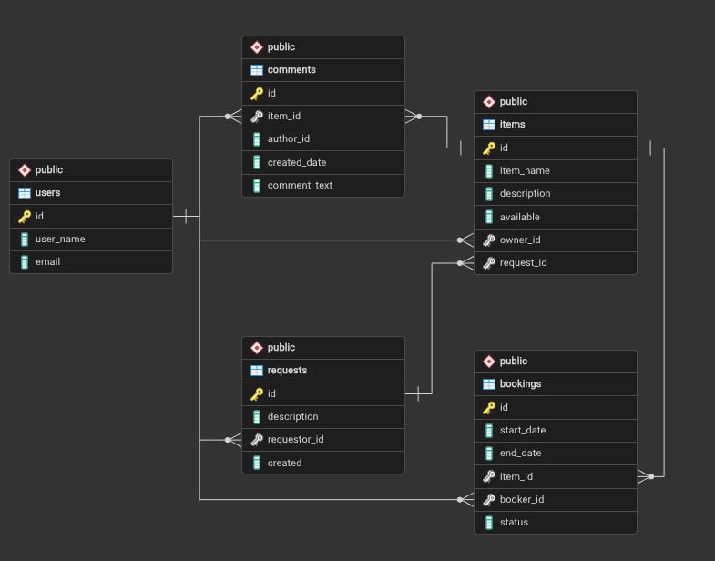
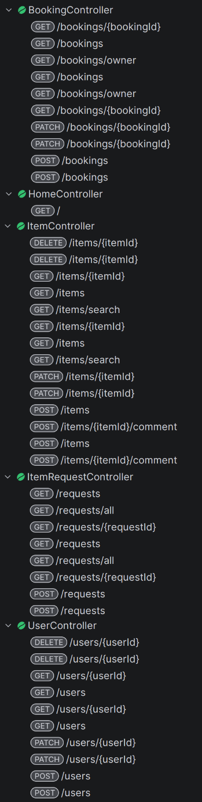

# java-shareit

## Бэкэнд для сервиса шеринга вещей

### Основные возможности
- Поиск вещей для аренды
- Публикация вещей для сдачи в аренду
- Создание запросов на вещь, если ее нет
- Отзывы о вещах взятых в аренду ранее

### Архитектура

### Схема базы данных

### API

### Используемые технологии
- Java 21
- Docker
- Spring Boot 3.5.9
- Lombok
- apache.httpcomponents
- PostgreSQL
- QueryDSL
- H2 database
- JUnit
- Mockito
- Jacoco

### Детали
Мультимодульный проект.  
Состоит из сервера (server) и шлюза (gateway).  
Шлюз выполняет функцию валидации входящих данных,
а также служит для масштабирования приложения.  
Сервер покрыт тестами на 100%