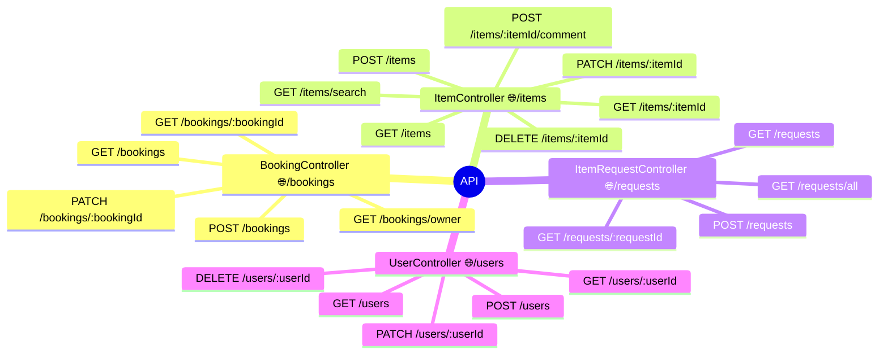

# java-shareit

## Бэкэнд для сервиса шеринга вещей

### Основные возможности
- Поиск вещей для аренды
- Публикация вещей для сдачи в аренду
- Создание запросов на вещь, если ее нет
- Отзывы о вещах взятых в аренду ранее

### Архитектура

### Схема базы данных

### API

### Детали
Мультимодульный проект.  
Состоит из сервера (server) и шлюза (gateway).  
Шлюз выполняет функцию валидации входящих данных,
а также служит для масштабирования приложения.  
Сервер покрыт тестами на 100%